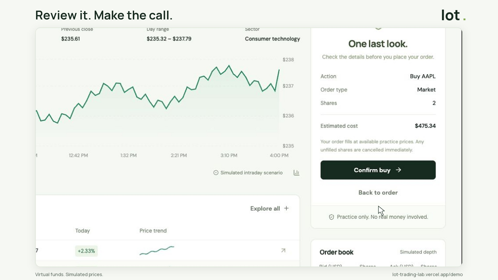

# Lot — Your trading ground

Practice making trading decisions with virtual money. Choose a synthetic market day in Lot Replay, reveal it as you go, write your plan, and review the result. Lot also includes a regular trading workspace, persistent accounts, portfolios, and order history. Public prices are simulated. Owner-only private mode reads Alpaca IEX data; funds, liquidity, and executions remain simulated.

**Replay release:** three reproducible scenarios, saved plans/reflections, performance recaps, explicit sharing, resting limit orders, observed portfolio history, and owner-only news. Production password-reset email delivery still needs an SMTP provider. See [release evidence](docs/REPLAY_VERIFICATION.md) and the [five-person usability script](docs/USER_RESEARCH.md).

**[Try Lot Replay without signup](https://lot-trading-lab.vercel.app/replay)** · [Live app](https://lot-trading-lab.vercel.app) · [Regular workspace](https://lot-trading-lab.vercel.app/demo)

## Watch the demo

[](https://lot-trading-lab.vercel.app/#watch-demo)

**[Watch the 48-second walkthrough](https://lot-trading-lab.vercel.app/#watch-demo)** · [Open the MP4](https://lot-trading-lab.vercel.app/demo/lot-walkthrough-polished.mp4) · [Try the workspace without signup](https://lot-trading-lab.vercel.app/demo)

The demo records actual guest buy/sell trades, portfolio updates, and completed orders. It includes cursor zooms, transitions, captions, and a written transcript. GitHub displays the linked poster; the live landing plays the video with native controls.

## Stack

| Layer | Implementation |
| --- | --- |
| Client | React 19, TypeScript, Redux Toolkit, Vite, Recharts |
| Account API | Python 3.12, Django 5.2 |
| Matching engine | Go, standard library HTTP handlers, binary heap |
| Persistence | PostgreSQL on Neon; SQLite for local development |
| Hosting | Vercel static frontend + Python and Go serverless functions |

## What you can do

- Replay a steady climb, sudden selloff, or volatile opening; only revealed prices and fictional dispatches reach the browser.
- Play/pause, change speed, advance moments, finish early, and retry the same path with a fresh independent $100,000 balance.
- Record a reason before replay trades, save reflections, and compare net return, drawdown, realized/unrealized gains, and fees against holding.
- Select light, standard, or challenging modeled spread, latency cost, and fees.
- Explicitly share finished recaps; journal notes remain private by default, and links can be revoked.
- Keep ordinary limit orders open with reserved cash/shares, cancel remainders, or choose immediate-or-cancel.
- Track observed 1D/1W/1M portfolio values with an honest holding comparison and tracking start.
- Read attributed real headlines in the owner-only Alpaca workspace.
- Open `/demo` immediately without signup; create an account later to save your progress.
- Watch the recorded buy, sell, portfolio, and activity walkthrough on the landing page.
- Explore eight stocks, interactive intraday charts, simulated depth, and an account watchlist.
- Connect owner-only Alpaca IEX prices and real five-minute chart bars, with actual exchange timestamps.
- Submit whole-share buy/sell market or limit orders with a review step.
- Review and confirm orders, then inspect individual fills and execution status.
- Create an account, log in and out, and change your password. Emailed recovery is implemented and locally verified; live delivery requires SMTP configuration.
- Restore your holdings, history, and watchlist from another browser.
- Track positions, cost basis, cash, total return, and allocation.
- Filter trade history, export the latest 50 orders to CSV, and reset your own demo.

New registered accounts start with $100,000 in virtual cash and no holdings. Guest workspaces include a seeded example portfolio with a $100,000 original cost basis; signing up from a guest workspace preserves its progress. Resetting creates a cash-only $100,000 portfolio. Django uses hashed passwords and Secure, HttpOnly, SameSite session cookies in production. Registered records persist in PostgreSQL and restore after login from another browser. Guests use a signed browser cookie for 30 days. No real-money trading is possible.

## Run locally

Prerequisites: Node 22.12+ (Node 24 recommended), Python 3.12+, Go 1.23+, and `uv` or Python's venv/pip.

```sh
npm ci
uv venv --python 3.12 .venv
uv pip install --python .venv/bin/python -r requirements-dev.txt
.venv/bin/python manage.py migrate
```

Start these in three terminals:

```sh
go run ./cmd/server
```

```sh
.venv/bin/python manage.py runserver 127.0.0.1:8000
```

```sh
npm run dev
```

Open http://127.0.0.1:5173. Vite proxies `/api/engine` to Go on port 8001 and the other API routes to Django on port 8000. `.env.example` documents configurable server environment variables. Django reads the process environment, not Vite's `.env.local` file. Local runs default to SQLite, an explicitly development-only signing key, and trusted localhost origins.

## Verification

```sh
npm run build
npm run lint
npm test
.venv/bin/python manage.py test
.venv/bin/ruff check .
go test -race ./api ./engine ./cmd/server
go vet ./api ./engine ./cmd/server
go build ./api ./engine ./cmd/server
```

Backend tests cover buy/sell accounting, idempotency and conflicting retries, cash constraints, insufficient holdings, partial fills, non-crossing limits, engine failure, CSRF, cookie tampering, and account isolation. Replay tests cover progressive reveal, persistent notes, stale revisions, conflicting retries, private sharing/revocation, shared liquidity, fee rounding, cash/share reservations, and event reconstruction. PostgreSQL tests exercise four simultaneous identical retries, competing purchases/sales, competing reservations, and both stale and duplicate replay actions; SQLite skips the six row-lock cases. Resting-order tests cover continuation fills, cancellation, invalid engine data, reconciliation, and ownership. Go tests cover price/time priority, best bid execution, limit bounds, and input rejection. Authentication tests cover CSRF, account ownership, copied cookies, guest promotion, session restoration, throttling, password changes, other-session revocation, and one-use reset links. Frontend tests cover exact currency parsing, portfolio valuation, chart windows, and stale responses after identity changes. See [replay release evidence](docs/REPLAY_VERIFICATION.md) for current results and [earlier verification](docs/VERIFICATION.md) for the prior release. The GitHub Actions workflow runs on a separate PostgreSQL 16 service. The deploy build also checks optional private news availability and prints only its status/count, without publisher content or credentials. It never connects to the production database. For integration checks against the three running local services:

```sh
.venv/bin/python scripts/smoke.py http://127.0.0.1:5173
.venv/bin/python scripts/auth_smoke.py http://127.0.0.1:5173
.venv/bin/python scripts/replay_smoke.py http://127.0.0.1:5173
.venv/bin/python manage.py reconcile
.venv/bin/python scripts/benchmark.py
```

Local password-reset messages are saved to the gitignored `.mailbox/` directory. See `docs/AUTHENTICATION.md` for email setup and deployment requirements.

## API

| Route | Method | Responsibility |
| --- | --- | --- |
| `/api/market?symbol=HOOD` | GET | Django: authenticated market proxy; private owner receives IEX data |
| `/api/connect` | POST | Django: exchange owner access token for signed account cookie |
| `/api/engine?symbol=HOOD` | GET | Go: simulated quotes, chart samples, and selected book |
| `/api/engine` | POST | Go: stateless execution calculation; does not mutate accounts |
| `/api/auth/session` | GET | Restore identity and issue CSRF cookie |
| `/api/auth/signup` | POST | Register and claim guest progress or open cash-only account |
| `/api/auth/login` | POST | Authenticate and restore owned account |
| `/api/auth/logout` | POST | End session |
| `/api/auth/password` | POST | Change password and revoke other sessions |
| `/api/auth/forgot` | POST | Send one-use recovery link |
| `/api/auth/reset` | POST | Validate recovery token and set password |
| `/api/preferences` | POST | Save the current account watchlist |
| `/api/account` | GET | Django: open/restore isolated account and issue CSRF cookie |
| `/api/orders` | POST | Django: validate, match, and persist order + position + ledger |
| `/api/orders/settle` | POST | Evaluate up to one eligible resting order, each at most once per 15-second bucket |
| `/api/orders/cancel` | POST | Cancel owned remaining shares and release reservations |
| `/api/orders/journal` | POST | Save an owned order reflection |
| `/api/portfolio/history?days=7` | GET | Observed values and holding comparison; windows 1, 7, or 30 days |
| `/api/replay` | GET/POST | Scenario catalog/saved sessions; start an independent replay |
| `/api/replay/<id>` | GET/POST | Restore/advance/trade/reflect/finish/share/revoke an owned replay |
| `/api/replay/shared/<token>` | GET | Deliberately shared finished recap; notes excluded by default |
| `/api/news?symbol=HOOD` | GET | Owner-only attributed Alpaca headlines |
| `/api/learning-metrics` | POST | Owner-only aggregate workspace activity, including verification |
| `/api/reset` | POST | Django: reset only the current demo account |
| `/api/health` | GET | Django: database connectivity check |

Order example (money is integer cents):

```json
{"symbol":"HOOD","side":"buy","kind":"limit","quantity":25,"limit":11850,"time_in_force":"gtc","reason":"Wait for my chosen entry price."}
```

Account mutations require a valid registered session, guest cookie, or owner session, plus `X-CSRFToken`. Registered account cookies alone cannot grant access to owned accounts. Order submissions additionally require a UUID `Idempotency-Key`. Identical retries return the original order; a different payload using that key receives HTTP 409.

## Correctness and tradeoffs

`transaction.atomic()` and `select_for_update()` serialize each PostgreSQL account's order/reset operations. The matching response, cash update, position cost basis, order, and cash-ledger entry form one transaction. Unique database constraints enforce per-account idempotency. Monetary values use integer cents throughout. Selling releases proportional cost basis using integer rounding; selling the entire position removes its complete remaining cost.

Replay actions lock their session, require a current revision and a UUID request key, and persist a payload fingerprint plus an event. The read-only reconciliation command reconstructs replay state from those events and checks ordinary cash anchors, movement chains, fill totals, and reservations. A stale version or conflicting retry returns 409. Sharing is explicit, notes are excluded by default, and revoked links return 404.

The Go engine heapifies a synthetic book in O(n), then takes the best price and earliest sequence for each fill in O(log n). Total matching cost is O(n + k log n), where n is depth and k is fills. Limits protect execution prices; Go computes an immediate execution slice. Django keeps `gtc` limit remainders open and reserves their cash/shares; `ioc` remainders cancel. Ordinary resting orders are checked while the regular workspace is open, at most one eligible order per quote observation. Each order is checked at most once per 15-second bucket. This is request-driven evaluation, not a continuously running exchange. Replay limits are evaluated at each revealed moment and expire when the session ends. A buy that exceeds available cash at execution is rejected atomically. Network retries can safely reuse their key.

This is a simulation, not a production brokerage. Ordinary synthetic liquidity regenerates for each engine request; replay liquidity is shared across all orders within each virtual moment; there is no global exchange, consolidated market feed, WebSocket service, actual clearing/settlement, or real-money integration. Registered users have multi-browser identity; guest identities remain browser scoped. Market polling is every 15 seconds while the page is open. Public chart time is fictional. Private charts use the latest available regular trading session's IEX bars and explicitly show its date; sparse bars are not fabricated. Last-trade prices may be old outside trading hours. SQLite does not provide PostgreSQL row-lock concurrency guarantees. The account lock is held during the bounded engine request (25-second timeout): a simple correctness tradeoff that should become a reservation/outbox workflow at larger scale. Observed history saves one valuation per minute received by the workspace, up to the latest 5,000 observations per selected window. Straight lines connect sparse observations. A reset starts a new history epoch. Replay history records each revealed moment and trade cost changes. Structured production request logs include a generated request ID, route pattern, method, status, and duration; they exclude identities, credentials, query strings, and request bodies. See [architecture](docs/ARCHITECTURE.md).

## Deploy to Vercel

1. Install the Vercel CLI separately (`npm install -g vercel`), sign in, and run `vercel link`.
2. Provision a separate Neon PostgreSQL database and connect it to this project.
3. Set `DATABASE_URL` and a random `DJANGO_SECRET_KEY` in the deployment environments. Production startup fails closed if either is missing. Use a distinct database for future preview environments that must not share demo data.
4. Apply migrations to the intended database **before** deployment, e.g. `vercel env run --environment production --project lot-trading-lab --scope dricmoys-projects -- .venv/bin/python scripts/migrate_production.py`. This is a manual deploy step; migrations do not run inside serverless requests.
5. Configure `PUBLIC_APP_URL`, a verified `DEFAULT_FROM_EMAIL`, and the SMTP settings listed in `.env.example`. Verify delivery before advertising password recovery.
6. Run `vercel --prod`. `vercel.json` builds the frontend and routes Python and Go independently.
7. Verify `/api/health`, `/api/engine`, registration, a complete buy and sell, logout/login restoration, password recovery, and mobile layout.

`MATCHING_ENGINE_URL` can override the Go endpoint. On Vercel it defaults to `https://$VERCEL_PROJECT_PRODUCTION_URL/api/engine`, keeping backend calls on the public production alias rather than a protected preview URL. `CSRF_TRUSTED_ORIGINS` is a comma-separated list for explicitly trusted proxy origins, normally unnecessary on the production same-origin app.

The browser never receives database credentials, Alpaca credentials, or the Django signing key. Never put any of them in a `VITE_` variable or commit environment files.


## Private Alpaca market data

Set production-only **Secret** environment variables `ALPACA_API_KEY_ID`, `ALPACA_API_SECRET_KEY`, and a random 32+ character `LOT_OWNER_ACCESS_TOKEN`. Use paper keys. The market provider calls `https://data.alpaca.markets/v2/stocks/...` with `feed=iex`; the news adapter calls `https://data.alpaca.markets/v1beta1/news` for up to five attributed headlines with `include_content=false`; it never calls any Alpaca order, funding, account, or live brokerage endpoint. Credentials never enter frontend bundles.

Click **Private market data** and enter the owner token. This opens a separate, persistent $100,000 cash practice account. A signed HttpOnly cookie protects access; reconnecting with the token restores the same account across browsers. Rotating the token changes the owner account identity and revokes old owner access. The local deployment's token is in the gitignored `.env.owner`; keep that file private.

Django checks the signed account identity before adding an internal, domain-separated SHA-256 token to Go requests. Browser-supplied upstream auth headers are ignored. Direct public Go calls retain synthetic data. Both displayed prices and simulated executions use Alpaca snapshots for the owner account. No provider error silently falls back to simulated quotes; expired-cache refresh failures return 503 and prevent account mutation. Snapshots cache for 30 seconds and selected-symbol bars for 60 seconds per warm Go process; cold starts and independent instances have separate caches. Each provider HTTP request times out after 7 seconds. Public responses and private proxy responses prohibit caching.

IEX is one exchange, **not** consolidated US pricing or NBBO. Chart bars are five-minute closes from the latest regular session found within ten calendar days. Only the selected symbol loads chart history. Real timestamps are shown in Eastern time; market closures or sparse IEX trading can produce older data. Simulator liquidity is generated around the latest available trade, including after hours; these fills do not represent executable exchange quotes.

[Alpaca's redistribution FAQ](https://alpaca.markets/support/redistribute-alpaca-api) says API data cannot be redistributed, so the personal feed is owner-only. Public visitors retain the synthetic demo. See [market-data documentation](https://docs.alpaca.markets/us/docs/about-market-data-api) and [stock bars reference](https://docs.alpaca.markets/us/reference/stockbarssingle).

## News and learning evidence

Real news is useful for the owner's regular workspace and is integrated through the existing Alpaca credentials. Public replay uses explicitly fictional, timed dispatches aligned with its synthetic clock. Real headlines are independent of simulated prices and do not drive replay paths. No paid news subscription was created. [Alpaca news reference](https://docs.alpaca.markets/us/v1.4.2/reference/news-3). [NewsAPI's developer plan](https://newsapi.org/pricing) is for development only, so it is unsuitable for the deployed app without a production plan.

The owner-only learning counters measure starts, fills, full-day/early finishes, and repeat **workspaces**, including disposable verification. They are not evidence of unique people, retention, or traction. [The five-person research script](docs/USER_RESEARCH.md) is ready to use; no human study results are claimed.
